<picture>
  <source media="(prefers-color-scheme: dark)" srcset="./assets/banner-dark.svg">
  <source media="(prefers-color-scheme: light)" srcset="./assets/banner-light.svg">
  
</picture>

<h1 align="center">Hamza Hmidani</h1>
<h3 align="center">Full Stack Developer</h3>

  Full Stack Developer passionate about building modern web applications, scalable systems, and clean user experiences. 
  Currently looking for internship opportunities and Junior Full Stack Developer positions.

  
  
  

## About Me

I am a Full Stack Developer based in Fes, Morocco, with a background in Computer Engineering and Digital Development. I enjoy building complete web solutions across frontend and backend layers, with a strong interest in software engineering, clean architecture, and scalable applications.

- Building modern web applications with practical business value
- Comfortable working on both frontend interfaces and backend logic
- Interested in maintainable code, performance, and system design
- Always learning new technologies and improving development skills

## Tech Stack

### Languages

### Frontend

### Backend

### Mobile

### Databases

### Tools

## Featured Projects

### Hotel Management System

Preview: add a screenshot at `./assets/projects/hotel-management-system.png`

A complete hotel reservation and management platform designed to streamline room booking, customer management, and operational workflows.

- GitHub: [Repository](#)
- Demo: [Live Demo](#)

### Car Rental Platform

Preview: add a screenshot at `./assets/projects/car-rental-platform.png`

A full-stack car rental application with vehicle listings, booking workflows, and user management features.

- GitHub: [Repository](#)
- Demo: [Live Demo](#)

### Healthcare Mobile Application

Preview: add a screenshot at `./assets/projects/healthcare-mobile-application.png`

An Android mobile application for healthcare cabinet management, built to simplify patient tracking and daily clinic operations.

- GitHub: [Repository](#)
- Demo: [Live Demo](#)

### Personal Portfolio

Preview: add a screenshot at `./assets/projects/personal-portfolio.png`

A personal developer portfolio website focused on presenting projects, technical skills, and professional identity in a clean modern layout.

- GitHub: [Repository](#)
- Demo: [Live Demo](#)

## GitHub Statistics

  
  

  

Rank is intentionally hidden because it is not representative for new developers and early-career profiles. Recruiters get more value from projects, consistency, and technical direction than from a computed rank badge.

## Contribution Snake

<picture>
  <source media="(prefers-color-scheme: dark)" srcset="./output/github-contribution-grid-snake-dark.svg">
  <source media="(prefers-color-scheme: light)" srcset="./output/github-contribution-grid-snake.svg">
  
</picture>

## Contact

- LinkedIn: [hamza-hmidani-395b1b382](https://www.linkedin.com/in/hamza-hmidani-395b1b382/)
- Portfolio: [hmidani-hamza.vercel.app](https://hmidani-hamza.vercel.app/)
- GitHub: [Hamza-Hmidani](https://github.com/Hamza-Hmidani)
- Email: `hamzahmidani)5@gmail.com`
- Location: `Fes, Morocco`
